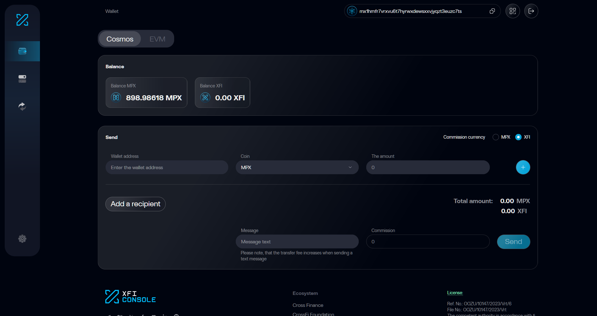

import Image from 'next/image'
import Link from 'next/link'

## Create or restore your wallet

Go to <Link href="https://testnet.xficonsole.com/">XFI Console</Link>
Click on "Create new wallet"
or if you already have the seed phrase, click on "Log in with a seed phrase"

<Image src="asset/itn1.png" alt="pict" width={500} height={500} />

Once you logged in, you will see this screen.

